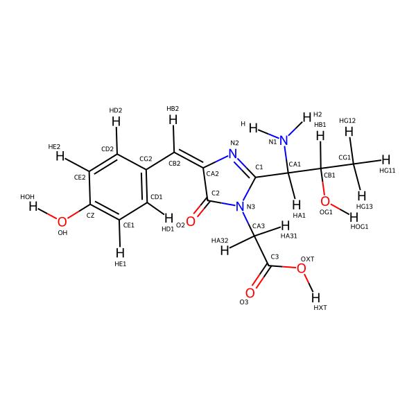
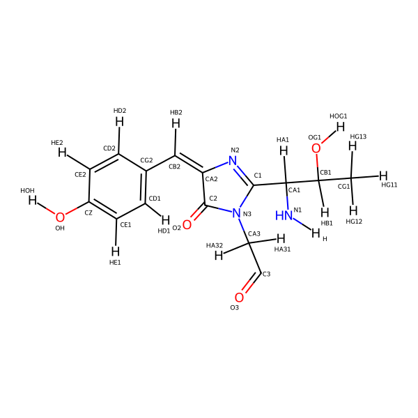

.. _py_build_temp:

Building residue templates in Python
===================================

The interpretation of the valence (bonds) and formal charge of atoms is an essential step when parsing a PDB/CIF file, and the accuracy of residue mapping is crucial to the creation of a macrobiomolecule system. In Meeko, the input residue names are used as keys and the chemical templates are retrieved accordingly based on :ref:`templates <templates>`. 

For the command line script for receptor preparatoin, ``mk_prepare_receptor.py``, there are three major ways of obtaining such templates: 

**(1) Loading from the default JSON file:** ``Meeko/meeko/data/residue_chem_templates.json``

This is the default residue template set curated by us, including: 

(a) the standard residues of proteins, RNAs and DNAs, 

(b) the modified residues from the following Amber24 OFF library files: 

.. code-block:: bash

    lib
    ├── amino19.lib
    ├── amino19ipq_0.9.lib
    ├── aminoct19ipq_0.9.lib
    ├── aminont19ipq_0.9.lib
    ├── phosaa19SB.lib
    ├── mod_amino19.lib
    ├── RNA.lib
    ├── terminalphos.LJbb-RNA.lib
    ├── DNA.OL15.lib
    ├── parmBSC1.lib
    └── all_modrna08.lib

(c) residues or ligands in CCD (Chemical Component Dictionary) that have conflicting names with the above residues. 

**(2) Loading by ``--add_template`` from an additional JSON file:** (example) ``Meeko/meeko/data/NAKB_templates.json``

This is an optional add-on template set generated by us, based on the curated set of modified nucleotides by Nucleic Acid Knowledgebase (NAKB). 

**(3) Fetching from PDB by CCD name on the run**

When an unknown residue is encountered, ``mk_prepare_receptor.py`` attempts to resolve its chemical identity by fetching a definition CIF file from PDB (Protein Data Bank) and generates chemical templates of all possible embedding forms of it when there are inter-residue bonds. Currently, this is an automated yet relatively simple process that only supports noncovalent ligands and residues with unmodified backbones. 

Here, we present a quick guide of building potentially complicated residue templates on your own using the ``meeko.chemtempgen`` submodule. In this example, we will be working with residue ``CRO``, a naturally occuring fluorophore in green fluorescent proteins formed by condensation of three consecutive residues Ser-Tyr-Gly. 

Example usage
-------------

Before we start, we will import the required modules and optionally, suppress excess rdkit loggings that may occur during the editing of molecular structures. Then we will create a ``ChemicalComponent`` from a definition CIF file, which will be obtained by ``fetch_from_pdb`` (Internet connection is required). 

.. code-block:: python

    from meeko.chemtempgen import *
    from rdkit import Chem
    from rdkit.Chem import Draw
    from rdkit import RDLogger
    from PIL import Image
    import io
    import copy
    import logging
    import sys
    
    rdkit_logger = RDLogger.logger()
    rdkit_logger.setLevel(RDLogger.CRITICAL)

    # Create a chemical component from the definition CIF file
    basename = "CRO" 
    CRO_from_cif = ChemicalComponent.from_cif(fetch_from_pdb(basename), basename) 

The created ``ChemicalComponent`` object, ``CRO_from_cif``, has a corresponding RDKit molecule where the atom names from the definition CIF file are stored under the ``"atom_id"`` property per atom. For a quick check, you may draw the RDKit molecule with noted atom names: 

.. code-block:: python

    def draw_cc_mol(cc_mol: Chem.Mol): 
        # Label atoms by atom name
        for atom in cc_mol.GetAtoms():
            atom.SetProp("atomNote", atom.GetProp("atom_id"))

        # Draw the molecule
        drawer = Draw.MolDraw2DCairo(600, 600) 
        drawer.DrawMolecule(cc_mol)
        drawer.FinishDrawing()

        # Get the image as PNG
        png_data = drawer.GetDrawingText()
        img = Image.open(io.BytesIO(png_data))
        img.show()

    draw_cc_mol(CRO_from_cif.rdkit_mol)

As we may see from the picture above, in order to forge ``CRO`` into a linking embedded fragment in a protein, some atoms need to be removed. In this example, we will simply do so by specifying the atom names. ``make_embedded`` calls function ``embed`` on the duplicated object ``cc``, which takes ``embed_allowed_smarts`` as the editable zone and removes atoms matching the names in ``leaving_names``. Here, the ``embed_allowed_smarts`` is chosen to be the SMARTS of altered backbone in residue ``CRO``. Note that by default, ``embed`` removes associated hydrogens for convenience. Therefore, in this case, ``leaving_names = {"H2", "OXT"}`` removes atoms ``H2``, ``OXT`` as well as the bonded hydrogen, ``HXT``. The same task could be alternatively done by the equivalent SMARTS pattern. 

.. code-block:: python

    cc = copy.deepcopy(CRO_from_cif)

    embed_allowed_smarts = "[NX2][CX4][CX3][NX3][CX4][CX3](=O)[OX2]"
    cc = cc.make_embedded(allowed_smarts = embed_allowed_smarts, leaving_names = {"H2", "OXT"})

    draw_cc_mol(cc.rdkit_mol)

Looking at the structure of the edited picture, we will see that the unneccessary atoms have gone and the hydrogens at the broken (blunt) ends become implict, which is exactly needed to generate the Smiles string for the chemical template. Function ``make_pretty_smiles`` makes the Smiles string with all Hs explicit for the template's RDKit molecule. Last but not least, we will determin the ``link_labels`` which specifies how ``CRO`` should be connected to other residues. Here, we will use the pattern from a built-in recipe, ``AA_recipe.pattern_to_label_mapping_standard``, which also applies to all other standard amino acid residues: ``{'[NX3h1]': 'N-term', '[CX3h1]': 'C-term'}``. Opionally, we can run a ``ResidueTemplate_check`` to see potential problems with the generated template. 

.. code-block:: python

    cc = (
        cc
        .make_pretty_smiles()
        .make_link_labels_from_patterns(pattern_to_label_mapping = AA_recipe.pattern_to_label_mapping_standard)
        )
    cc.ResidueTemplate_check()
    export_chem_templates_to_json([cc])

``export_chem_templates_to_json`` returns a JSON string of the residue template, with the corresponding content printed to console: 

.. code-block:: bash

    ******************** New Template Built ********************
    {
        "ambiguous": {
            "CRO": ["CRO"]
        },
        "residue_templates": {
            "CRO": {
                "smiles": "[H]NC([H])(C1=NC(=C([H])C2=C([H])C([H])=C(O[H])C([H])=C2[H])C(=O)N1C([H])([H])C=O)C([H])(O[H])C([H])([H])[H]",
                "atom_name": ["H", "N1", "CA1", "HA1", "C1", "N2", "CA2", "CB2", "HB2", "CG2", "CD1", "HD1", "CE1", "HE1", "CZ", "OH", "HOH", "CE2", "HE2", "CD2", "HD2", "C2", "O2", "N3", "CA3", "HA31", "HA32", "C3", "O3", "CB1", "HB1", "OG1", "HOG1", "CG1", "HG11", "HG12", "HG13"],
                "link_labels": {"1": "N-term", "27": "C-term"}
            }
        }
    }
    ************************************************************

You may now wonder: What if the residue locates at the C- or N-terminal of the protein? Although this is not common for ``CRO``, we will go with it for demonstration purposes. 

To make the N-terminal embedding variant of ``CRO``: 

.. code-block:: python

    # Duplicate and start over from the original chemical component
    cc_N = copy.deepcopy(CRO_from_cif)

    cc_N = (
        cc_N
        # Remove atom OXT
        .make_embedded(allowed_smarts = embed_allowed_smarts, leaving_names = {"OXT"})
        # Cap (protonate) atom N
        .make_capped(allowed_smarts = embed_allowed_smarts, capping_names = {"N1"}, protonate = True)
        # (Re)generate Smiles with all Hs explicit
        .make_pretty_smiles()
        # Find linker atoms
        .make_link_labels_from_patterns(pattern_to_label_mapping = AA_recipe.pattern_to_label_mapping_standard)
        )

    cc_N.ResidueTemplate_check()
    # In case there are already residue templates with the same parent (original) residue name
    cc_N.resname += "_N"
    export_chem_templates_to_json([cc_N])

In the chained procedure above, we have removed ``OXT`` and protonated ``N1``, which is done by ``make_capped`` that adds hydrogen(s) to matching atom(s) with specified ``capping_names`` within the region of ``allowed_smarts``. The expected outout from ``export_chem_templates_to_json`` is: 

.. code-block:: bash

    Atom # 0 (N1) in mol doesn't have implicit Hs -> continue with next atom... 
    Molecule doesn't contain wanted_smarts: [NX3h1] -> continue with next pattern... 
    Molecule doesn't contain pattern: [NX3h1] -> linker label for N-term will not be made. 
    ******************** New Template Built ********************
    {
        "ambiguous": {
            "CRO": ["CRO_N"]
        },
        "residue_templates": {
            "CRO": {
                "smiles": "[H]OC1=C([H])C([H])=C(C([H])=C2N=C(C([H])(N([H])[H])C([H])(O[H])C([H])([H])[H])N(C([H])([H])C=O)C2=O)C([H])=C1[H]",
                "atom_name": ["HOH", "OH", "CZ", "CE1", "HE1", "CD1", "HD1", "CG2", "CB2", "HB2", "CA2", "N2", "C1", "CA1", "HA1", "N1", "H", "H2", "CB1", "HB1", "OG1", "HOG1", "CG1", "HG11", "HG12", "HG13", "N3", "CA3", "HA31", "HA32", "C3", "O3", "C2", "O2", "CD2", "HD2", "CE2", "HE2"],
                "link_labels": {"30": "C-term"}
            }
        }
    }
    ************************************************************

To make the C-terminal embedding variant of ``CRO``: 

.. code-block:: python

    # Duplicate and start over from the original chemical component
    cc_C = copy.deepcopy(CRO_from_cif)

    cc_C = (
        cc_C
        # Deprotonate the carboxylate group
        .make_canonical(acidic_proton_loc = {'[H][O][C](=O)': 0})
        # Remove atom H2
        .make_embedded(allowed_smarts = embed_allowed_smarts, leaving_names = {"H2"})
        # (Re)generate Smiles with all Hs explicit
        .make_pretty_smiles()
        # Find linker atoms
        .make_link_labels_from_patterns(pattern_to_label_mapping = AA_recipe.pattern_to_label_mapping_standard)
        )

    cc_C.ResidueTemplate_check()
    # In case there are already residue templates with the same parent (original) residue name
    cc_C.resname += "_C"
    export_chem_templates_to_json([cc_C])

In the chained procedure above, we have deprotonated the carboxylate group(s) and removed ``H2``. The deprotonation is done by ``make_canonical`` that deprotonates all protons specified by ``acidic_proton_loc``, which includes a SMARTS pattern and the index of the proton. ``chemtempgen.py`` also includes a constant ``acidic_proton_loc_canonical``, which is potentially useful as a universal protocol to deprotonate the acidic protons to get the canonical protonation state at near physiological pH. 

.. code-block:: python

    # Constants for deprotonate
    acidic_proton_loc_canonical = {
            # any carboxylic acid, sulfuric/sulfonic acid/ester, phosphoric/phosphinic acid/ester
            '[H][O]['+atom+'](=O)': 0 for atom in ('CX3', 'SX4', 'SX3', 'PX4', 'PX3')
        } | {
            # any thio carboxylic/sulfuric acid
            '[H][O]['+atom+'](=S)': 0 for atom in ('CX3', 'SX4')
        } | {
            '[H][SX2][a]': 0, # thiophenol
        }

The expected output is: 

.. code-block:: bash

    Molecule doesn't contain wanted_smarts: [CX3h1] -> continue with next pattern... 
    Molecule doesn't contain pattern: [CX3h1] -> linker label for C-term will not be made. 
    ******************** New Template Built ********************
    {
        "ambiguous": {
            "CRO": ["CRO_C"]
        },
        "residue_templates": {
            "CRO_C": {
                "smiles": "[H]NC([H])(C1=NC(=C([H])C2=C([H])C([H])=C(O[H])C([H])=C2[H])C(=O)N1C([H])([H])C(=O)[O-])C([H])(O[H])C([H])([H])[H]",
                "atom_name": ["H", "N1", "CA1", "HA1", "C1", "N2", "CA2", "CB2", "HB2", "CG2", "CD1", "HD1", "CE1", "HE1", "CZ", "OH", "HOH", "CE2", "HE2", "CD2", "HD2", "C2", "O2", "N3", "CA3", "HA31", "HA32", "C3", "O3", "OXT", "CB1", "HB1", "OG1", "HOG1", "CG1", "HG11", "HG12", "HG13"],
                "link_labels": {"1": "N-term"}
            }
        }
    }
    ************************************************************

If you have generated ``cc``, ``cc_N``, and ``cc_C``, you may write them all into one JSON file: 

.. code-block:: python

    export_chem_templates_to_json([cc, cc_N, cc_C], json_fname = "CRO_templates.json")

And below is the content of ``CRO_templates.json``, which can be loaded by ``mk_prepare_receptor --add_templates CRO_templates.json`` during receptor preparation: 

.. code-block:: bash

    {
        "ambiguous": {
            "CRO": ["CRO", "CRO_N", "CRO_C"]
        },
        "residue_templates": {
            "CRO": {
                "smiles": "[H]NC([H])(C1=NC(=C([H])C2=C([H])C([H])=C(O[H])C([H])=C2[H])C(=O)N1C([H])([H])C=O)C([H])(O[H])C([H])([H])[H]",
                "atom_name": ["H", "N1", "CA1", "HA1", "C1", "N2", "CA2", "CB2", "HB2", "CG2", "CD1", "HD1", "CE1", "HE1", "CZ", "OH", "HOH", "CE2", "HE2", "CD2", "HD2", "C2", "O2", "N3", "CA3", "HA31", "HA32", "C3", "O3", "CB1", "HB1", "OG1", "HOG1", "CG1", "HG11", "HG12", "HG13"],
                "link_labels": {"1": "N-term", "27": "C-term"}
            },
            "CRO_N": {
                "smiles": "[H]OC1=C([H])C([H])=C(C([H])=C2N=C(C([H])(N([H])[H])C([H])(O[H])C([H])([H])[H])N(C([H])([H])C=O)C2=O)C([H])=C1[H]",
                "atom_name": ["HOH", "OH", "CZ", "CE1", "HE1", "CD1", "HD1", "CG2", "CB2", "HB2", "CA2", "N2", "C1", "CA1", "HA1", "N1", "H", "H2", "CB1", "HB1", "OG1", "HOG1", "CG1", "HG11", "HG12", "HG13", "N3", "CA3", "HA31", "HA32", "C3", "O3", "C2", "O2", "CD2", "HD2", "CE2", "HE2"],
                "link_labels": {"30": "C-term"}
            },
            "CRO_C": {
                "smiles": "[H]NC([H])(C1=NC(=C([H])C2=C([H])C([H])=C(O[H])C([H])=C2[H])C(=O)N1C([H])([H])C(=O)[O-])C([H])(O[H])C([H])([H])[H]",
                "atom_name": ["H", "N1", "CA1", "HA1", "C1", "N2", "CA2", "CB2", "HB2", "CG2", "CD1", "HD1", "CE1", "HE1", "CZ", "OH", "HOH", "CE2", "HE2", "CD2", "HD2", "C2", "O2", "N3", "CA3", "HA31", "HA32", "C3", "O3", "OXT", "CB1", "HB1", "OG1", "HOG1", "CG1", "HG11", "HG12", "HG13"],
                "link_labels": {"1": "N-term"}
            }
        }
    }