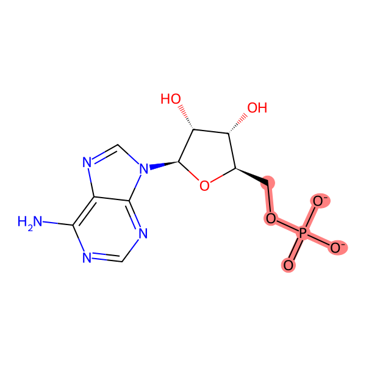

.. _tutorial2:

=========================
Reactive Docking
=========================

This is a reactive docking example that uses the AutoDock-GPU executable to generate the near-attack conformation of a small molecule and a protein receptor. 

Follow the instructions to set up the environment and run this command-line example on your own device (Linux, MacOS or WSL). To run this example in a Colab notebook, see :ref:`colab_examples`. 

.. contents::
   :local:
   :depth: 2

Introduction
============

The reactive docking example is based on reactive docking method that has been developed for high-throughput virtual screenings of reactive species. This method is currently only implemented in AutoDock-GPU. In this example, a small molecule substrate (Adenosine monophosphate, PDB token AMP) is targeting at the catalytic histidine residue of a hollow protein structure of bacteria RNA 3' cyclase (PDB token 3KGD) to generate the near-attack conformation for the formation of the phosphoamide bond. A docked pose that closely resembles the original position of the ligand is expected among the top-ranked poses. 

This tutorial is intended to showcase the Meeko usage in the preparation of receptor and ligand for reactive docking. 

Prerequisites and Environment Setup
===================================

Create a new virtual environment (recommended)
~~~~~~~~~~~~~~~~~~~~~~~~~~~~~~~~~~~~~~~~~~~~~~

.. code-block:: bash

   micromamba create -c conda-forge -n meeko_tutorial python=3.10 -y
   micromamba activate meeko_tutorial         

In this tutorial, we will use ``micromamba`` as the example package manager. Visit `this official guide  <https://mamba.readthedocs.io/en/latest/installation/micromamba-installation.html>`_ for a quick install and setup of micromamba. There are many equivalent ways to manage Python packages, such as ``conda`` and ``mamba``. You can easily adapt the commands to your preferred tool, as the syntax is largely compatible across these package managers. 

Install the required Python packages through ``conda-forge``
~~~~~~~~~~~~~~~~~~~~~~~~~~~~~~~~~~~~~~~~~~~~~~~~~~~~~~~~~~~~

.. code-block:: bash

   micromamba install -c conda-forge cctbx-base numpy scipy rdkit gemmi -y

Install the additional packages and data from GitHub repositories
~~~~~~~~~~~~~~~~~~~~~~~~~~~~~~~~~~~~~~~~~~~~~~~~~~~~~~~~~~~~~~~~~

- (Python package) Meeko 

.. code-block:: bash

   git clone --single-branch --branch develop https://github.com/forlilab/Meeko.git
   cd Meeko; pip install --use-pep517 -e .; cd ..

- (Python package) scrubber 

.. code-block:: bash

   git clone --single-branch --branch develop https://github.com/forlilab/scrubber.git
   cd scrubber; pip install --use-pep517 -e .; cd ..

- (Python package) ProDy 

.. code-block:: bash

   pip install prody

- (Required data package for reduce2) Phenix Project geostd (restraint) Library 

.. code-block:: bash

   git clone https://github.com/phenix-project/geostd.git

Ligand Preparation
=================

In this step, the ligand molecule is prepared from a Smiles string. A protonated 3D conformer of ligand is generated by ``scrub.py``, and the conversion to a tangible ligand PDBQT file is done by ``mk_prepare_ligand.py``. 

The ligand of this example is AMP (adenosine monophosphate). We will use its isomeric Smiles string as the input, and manually write the phosphate group in the -2 charge state. ``scrub.py`` will generate an SDF file, ``AMP.sdf``, containing a 3D conformer of AMP (2-) with all explicit hydrogens. 

.. code-block:: bash

    ligand_smiles="c1nc(c2c(n1)n(cn2)[C@H]3[C@@H]([C@@H]([C@H](O3)COP(=O)([O-])[O-])O)O)N"
    scrub.py $ligand_smiles -o AMP.sdf --skip_tautomer --skip_acidbase

To prepare AMP (2-) as an reactive ligand, we specify the reactive phosphoryl atom by Smarts string ``COP(=O)([O-])[O-]`` and the index number ``3``. With ``AMP.sdf`` as the input file, the command-line script ``mk_prepare_ligand.py`` looks for matches of the Smarts string ``reactive_smarts`` in the input molecule structure, making the ith atom in the match a reactive atom based on the 1-based index number ``reactive_smarts_idx``. 

.. code-block:: bash

    reactive_smarts="COP(=O)([O-])[O-]"
    reactive_smarts_idx=3
    mk_prepare_ligand.py -i AMP.sdf -o AMP.pdbqt \
    --reactive_smarts $reactive_smarts \
    --reactive_smarts_idx $reactive_smarts_idx

The generated ligand PDBQT file, ``AMP.pdbqt``, will contain special AutoDock atom types for the reactive docking. The reactive atom types encode the atom type as well as the adjacency to the reactive atom. In this example: ``P1`` denotes the reactive phosphorus atom (with order number = 1). ``O5`` denotes the neighbor ``OA`` atoms (with order number = 2). Because the original atom type (``OA``) contains 2 letters, an additional increment of +3 is applied to the number suffix. And finally ``C3`` denotes the further ``C`` type atom (aliphatic carbon, with order number = 3). 

.. code-block:: bash

    REMARK SMILES Nc1ncnc2c1ncn2[C@@H]1O[C@H](COP(=O)([O-])[O-])[C@@H](O)[C@H]1O
    REMARK SMILES IDX 11 1 22 2 20 3 13 4 12 5 10 6 4 7 3 8 5 9 2 10 6 11 7 12
    REMARK SMILES IDX 8 13 9 14 1 15 23 18 21 20 14 22 15 23 16 24 17 25 18 26
    REMARK SMILES IDX 19 27
    REMARK H PARENT 1 16 1 17 23 19 21 21
    ROOT
    ATOM      1  C   UNL     1       0.091  -0.756   0.545  1.00  0.00     0.253 C 
    ATOM      2  C   UNL     1       0.369  -1.495  -0.773  1.00  0.00     0.195 C 
    ATOM      3  C   UNL     1       1.476  -0.670  -1.387  1.00  0.00     0.179 C 
    ATOM      4  C   UNL     1       2.147  -0.047  -0.164  1.00  0.00     0.178 C 
    ATOM      5  O   UNL     1       1.163   0.124   0.832  1.00  0.00    -0.347 OA
    ENDROOT
    BRANCH   1   6
    ATOM      6  N   UNL     1      -1.156   0.007   0.449  1.00  0.00    -0.285 N 
    ATOM      7  C   UNL     1      -4.095  -1.786   1.544  1.00  0.00     0.226 A 
    ATOM      8  N   UNL     1      -5.018  -0.824   1.216  1.00  0.00    -0.217 NA
    ATOM      9  N   UNL     1      -2.764  -1.577   1.316  1.00  0.00    -0.216 NA
    ATOM     10  C   UNL     1      -4.639   0.363   0.654  1.00  0.00     0.155 A 
    ATOM     11  C   UNL     1      -2.392  -0.395   0.766  1.00  0.00     0.167 A 
    ATOM     12  C   UNL     1      -3.282   0.566   0.430  1.00  0.00     0.150 A 
    ATOM     13  N   UNL     1      -2.654   1.617  -0.131  1.00  0.00    -0.231 NA
    ATOM     14  C   UNL     1      -1.348   1.232  -0.108  1.00  0.00     0.204 A 
    BRANCH  10  15
    ATOM     15  N   UNL     1      -5.614   1.348   0.310  1.00  0.00    -0.382 N 
    ATOM     16  H   UNL     1      -5.332   2.257  -0.120  1.00  0.00     0.158 HD
    ATOM     17  H   UNL     1      -6.627   1.168   0.488  1.00  0.00     0.158 HD
    ENDBRANCH  10  15
    ENDBRANCH   1   6
    BRANCH   2  18
    ATOM     18  O   UNL     1       0.753  -2.832  -0.545  1.00  0.00    -0.386 OA
    ATOM     19  H   UNL     1       1.495  -2.835   0.115  1.00  0.00     0.211 HD
    ENDBRANCH   2  18
    BRANCH   3  20
    ATOM     20  O   UNL     1       2.354  -1.419  -2.197  1.00  0.00    -0.387 OA
    ATOM     21  H   UNL     1       2.901  -2.009  -1.617  1.00  0.00     0.211 HD
    ENDBRANCH   3  20
    BRANCH   4  22
    ATOM     22  C   UNL     1       2.798   1.302  -0.496  1.00  0.00     0.201 C3
    BRANCH  22  23
    ATOM     23  O   UNL     1       3.411   1.842   0.657  1.00  0.00    -0.348 O5
    BRANCH  23  24
    ATOM     24  P   UNL     1       5.100   1.600   0.586  1.00  0.00     0.060 P1
    ATOM     25  O   UNL     1       5.699   2.493  -0.477  1.00  0.00    -0.326 O5
    ATOM     26  O   UNL     1       5.775   1.996   2.085  1.00  0.00    -0.790 O5
    ATOM     27  O   UNL     1       5.459  -0.015   0.231  1.00  0.00    -0.790 O5
    ENDBRANCH  23  24
    ENDBRANCH  22  23
    ENDBRANCH   4  22
    TORSDOF 7

Receptor Preparation
===================

The preparation of a rigid receptor consists of two steps. The receptor structure is first sourced from a PDB file and sent to ``reduce2.py`` for hydrogen addition and optimization, and then, the conversion to a tangible receptor PDBQT file is done by ``mk_prepare_receptor.py``.

In this example, we begin from retrieving the PDB structure by token ``3kgd`` from RCSB PDB. 

.. code-block:: bash

    pdb_token="3kgd"
    curl "http://files.rcsb.org/view/${pdb_token}.pdb" -o "${pdb_token}.pdb"

Next, we will run a Python script to write ProDy selection ``chain A and not water and not hetero and not resname AMP`` to a PDB file ``3kgd_receptor_atoms.pdb``. 

.. code-block:: python

    python - <<EOF
    from prody import parsePDB, writePDB

    pdb_token = "3kgd"
    atoms_from_pdb = parsePDB(pdb_token)
    receptor_selection = "chain A and not water and not hetero and not resname AMP"
    receptor_atoms = atoms_from_pdb.select(receptor_selection)
    prody_receptorPDB = f"{pdb_token}_receptor_atoms.pdb"
    writePDB(prody_receptorPDB, receptor_atoms)
    EOF

Then, we will combine CRYST1 card in the original PDB file (``3kgd.pdb``) and ``3kgd_receptor_atoms.pdb``. This is required by the current version of reduce2 (as of Oct 2024). The combined PDB file ``3kgd_receptor.pdb`` will be the input structure for ``reduce2.py``. 

.. code-block:: bash

    cat <(grep "CRYST1" "${pdb_token}.pdb") "${pdb_token}_receptor_atoms.pdb" > "${pdb_token}_receptor.pdb"

In this example, we use ``reduce2.py`` to add hydrogen atoms to the receptor structure and optimize the positions. There are various other tools (``H++``, ``APBS``, etc.) of choices for this task. It should also be noted that ``mk_prepare_receptor.py`` does not neccessarily need the presence of all hydrogens in the input receptor structure – The missing hydrogens will be added through RDKit functions during the receptor preparation with ProDy selection ``chain A and not water and not hetero and not resname AMP`` to a PDB file ``3kgd_receptor_atoms.pdb``.  

.. code-block:: bash

   # setting up reduce2 for the first time in the environment
   reduce2="$(python -c "import site; print(site.getsitepackages()[0])")/mmtbx/command_line/reduce2.py"
   chmod +x $reduce2
   geostd="$(realpath geostd)"
   export MMTBX_CCP4_MONOMER_LIB=$geostd

   # running reduce2 on the example receptor PDB
   reduce_opts="approach=add add_flip_movers=True"
   python $reduce2 "${pdb_token}_receptor.pdb" $reduce_opts

After running the last command above, ``reduce2.py`` will conclude a normal execution with a log file ``3kgd_receptorH.txt`` and a protonated receptor structure file ``3kgd_receptorH.pdb`` – The PDB file can then be fed to ``mk_prepare_receptor.py`` to generate the receptor PDBQT file. But before that, we could (optionally) save the original position of residue AMP and use it to define the grid box for docking. To do this, we will use ProDy selection ``chain A and resname AMP`` to write a PDB file ``LIG.pdb``

.. code-block:: python

    python - <<EOF
    from prody import parsePDB, writePDB, calcCenter

    pdb_token = "3kgd"
    atoms_from_pdb = parsePDB(pdb_token)
    ligand_selection = "chain A and resname AMP"
    ligand_atoms = atoms_from_pdb.select(ligand_selection)
    prody_ligandPDB = "LIG.pdb"
    writePDB(prody_ligandPDB, ligand_atoms)
    EOF

Now we're ready with the H-optimized receptor structure ``3kgd_receptorH.pdb`` and the position of the original ligand PDB file ``LIG.pdb``, we will proceed to receptor preparation. Here, we will specify that the reactive atom in the receptor is the Nε atom of His309 in PDB structure ``3kgd``, a bacteria RNA 3’ cyclase – The full argument will be ``--reactive_name_specific "A:309=NE2"``. Additionally, we will let the default AltLoc ID to be ``A`` for any residues with alternate locations. 

.. code-block:: bash

    reactive_name_specific="A:309=NE2"
    mk_prepare_receptor.py -i "${pdb_token}_receptorH.pdb" -o "${pdb_token}_receptorH" -p -g \
    --default_altloc A --reactive_name_specific $reactive_name_specific \
    --box_enveloping "LIG.pdb" --padding 8.0 

For box definition: We are using ``LIG.pdb`` as the centered object with a padding distance of ``8.0`` Angstrom in each dimension. The box definition will be written to the GPF. 

For output control: We are expecting at least two types of files, the receptor PDBQT file (in response to ``-p``) and an Autogrid4 GPF (in response to ``-g``). Specifically for reactive docking, there will be a few more input files generated by ``mk_prepare_receptor.py`` – They are listed at the end of the standard output after running the ``mk_prepare_receptor.py`` command. 

.. code-block:: bash

    @> 2510 atoms and 1 coordinate set(s) were parsed in 0.01s.

    Flexible residues:
    chain resnum is_reactive reactive_atom
        A    309        True           NE2
    reactive_flexres={'A:309'}

    For reactive docking, pass the configuration file to AutoDock-GPU:
        autodock_gpu -C 1 --import_dpf 3kgd_receptorH.reactive_config --flexres 3kgd_receptorH_flex.pdbqt -L <ligand_filename>

    Files written:
        3kgd_receptorH_flex.pdbqt <-- flexible receptor input file
        3kgd_receptorH_rigid.pdbqt <-- static (i.e., rigid) receptor input file
        boron-silicon-atom_par.dat <-- atomic parameters for B and Si (for autogrid)
        3kgd_receptorH_rigid.gpf <-- autogrid input file
            3kgd_receptorH.box.pdb <-- PDB file to visualize the grid box
    3kgd_receptorH.reactive_config <-- reactive parameters for AutoDock-GPU

The expected ``3kgd_receptorH_flex.pdbqt`` contains the reactive flexible residue, His309. Note that for the receptor residues, the reactive atom types may include a number prefix as an identifier to distinguish among possible multiple reactive residues. 

.. code-block:: bash

    BEGIN_RES HIS A 309
    REMARK INDEX MAP 3 1 15 2 18 3 19 4 20 5 21 6 22 7 25 8
    ROOT
    ATOM      1  CA  HIS A 309      -1.221 -40.602  -5.650  1.00  0.00     0.177 C 
    ENDROOT
    BRANCH   1   2
    ATOM      2  CB  HIS A 309      -2.472 -39.882  -5.156  1.00  0.00     0.093 C 
    BRANCH   2   3
    ATOM      3  CG  HIS A 309      -3.505 -40.770  -4.538  1.00  0.00     0.061 1A3
    ATOM      4 ND1  HIS A 309      -3.678 -42.083  -4.910  1.00  0.00    -0.242 1N6
    ATOM      5 CD2  HIS A 309      -4.442 -40.512  -3.593  1.00  0.00     0.107 1A2
    ATOM      6 CE1  HIS A 309      -4.660 -42.611  -4.192  1.00  0.00     0.196 1A2
    ATOM      7 NE2  HIS A 309      -5.152 -41.670  -3.401  1.00  0.00    -0.350 1N1
    ATOM      8 HE2  HIS A 309      -5.940 -41.788  -2.748  1.00  0.00     0.167 1H5
    ENDBRANCH   2   3
    ENDBRANCH   1   2
    END_RES HIS A 309

Docking Calculation
===================

The reactive docking method is only implemented in AutoDock-GPU, which also requires grid map computation with AutoGrid4 before the docking calculation. 

The previously generated GPF file (``3kgd_receptorH_rigid.gpf``), together with the PDBQT file of the rigid part of the receptor (``3kgd_receptorH_rigid.pdbqt``), will be used to compute the grid maps: 

.. code-block:: bash

    ./autogrid4 -p 3kgd_receptorH_rigid.gpf

And to run the docking calculation, the ligand PDBQT file (``AMP.pdbqt``), the flexible residue PDBQT file (``3kgd_receptorH_flex.pdbqt``), the special docking parameter file (DPF) for reactive docking (``3kgd_receptorH.reactive_config``), and the map files will be needed. With the following command for docking calculation, the output file will have basename ``AMP``.  

.. code-block:: bash

    ./adgpu --lfile AMP.pdbqt --flexres 3kgd_receptorH_flex.pdbqt --ffile 3kgd_receptorH_rigid.maps.fld --import_dpf 3kgd_receptorH.reactive_config --resnam AMP

If you're running these calculations on Google T4 backends, here are the pre-compiled executables of autogrid4 and adgpu specifically for T4: 

- autodock-gpu v1.5.3
`autodock_gpu_128wi <https://github.com/rwxayheee/Colabs/blob/acd2972f4afbf8c5299ebf0686534f466bf6f81b/Compiled_for_Colab/AutoDock-GPU_v1.5.3/autodock_gpu_128wi>`_
`adgpu_analysis <https://github.com/rwxayheee/Colabs/blob/acd2972f4afbf8c5299ebf0686534f466bf6f81b/Compiled_for_Colab/AutoDock-GPU_v1.5.3/adgpu_analysis>`_

- autogrid v4.2.6
`autogrid4 <https://github.com/rwxayheee/Colabs/blob/acd2972f4afbf8c5299ebf0686534f466bf6f81b/Compiled_for_Colab/AutoGird_v4.2.6/autogrid4>`_

Export the Docking Poses
========================

``mk_export.py`` is a command-line script in Meeko to export docking poses from PDBQT or DLG formats. For this example, if we want to export the ligand docking poses to a (possibly multi-model) SDF file with fully explicit hydrogens: 

.. code-block:: bash

    mk_export.py AMP.dlg -s 3kgd_AMP_adgpu_out.sdf
