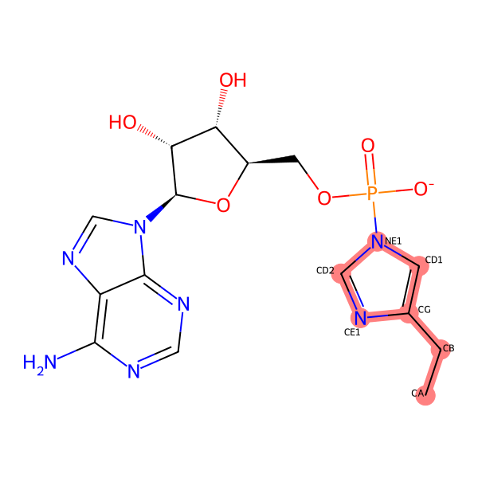

.. _tutorial3:

=========================
Tethered Docking
=========================

This is a tethered (two-point attached covalent) docking example that uses the AutoDock-GPU executable to reproduce a covalent complex of a small molecule and a protein receptor.

Follow the instructions to set up the environment and run this command-line example on your own device (Linux, MacOS or WSL). To run this example in a Colab notebook, see :ref:`colab_examples`. 

Introduction
============

The covalent docking example is based on the two-point attractor and flexible sidechain method. In this example, a small molecule substrate (Adenosine monophosphate, PDB token AMP) is attached to the catalytic histidine residue of a hollow protein structure of bacteria RNA 3' cyclase (PDB token 3KGD) to reproduce the covalent intermediate complex structure. A docked pose that closely resembles the original position of the ligand is expected among the top-ranked poses. 

This tutorial is intended to showcase the Meeko usage in the preparation of receptor and ligand for tethered docking. 

Prerequisites and Environment Setup
===================================

Follow the instructions in the previous tutorial for environment setup: :ref:`env_setup_like_colab`. 

Ligand Conformer Generation
===========================

In this step, the ligand molecule is prepared from a Smiles string. A protonated 3D conformer of the covalent residue-ligand conjugate will be generated by ``scrub.py``. 

For tethered docking, the ligand needs to a covalent conjugate of ligand and a residue that include the following components:

- the part of ligand present in the covalent conjuage, flexible in docking.
- the part of residue sidechain present in the covalent conjugate, flexible in docking.
- the residue's C-alpha and C-beta, which work as the two-point attractors and their positions remain unchanged in docking. The other backbone atoms are not required.

The ligand of this example will be the covalent conjugate ``HIE_AMP``, where AMP is attached to the Nε atom of a histidine residue via forms a phosphoamide bond. We will use its isomeric Smiles string as the input, and manually write the phosphoester group in the -1 charge state. ``scrub.py`` will generate an SDF file, ``HIE_AMP.sdf``, containing a 3D conformer of HIE-AMP (1-) with all explicit hydrogens. 

.. code-block:: bash
   
    ligand_smiles="c1nc(c2c(n1)n(cn2)[C@H]3[C@@H]([C@@H]([C@H](O3)COP(=O)([O-])N1C=C(CC)N=C1)O)O)N"
    scrub.py $ligand_smiles -o HIE_AMP.sdf --skip_tautomer --skip_acidbase

To prepare HIE-AMP (1-) as an covalent flexible residue, we will hold this SDF file for further mapping with the specific catalytic residue in receptor structure. In fact, the SDF file can be re-used for different Histidine residues in different receptor structures. 

Receptor Preparation
===================

The preparation of a rigid receptor consists of two steps. The receptor structure is first sourced from a PDB file and sent to ``reduce2.py`` for hydrogen addition and optimization, and then, the conversion to a tangible receptor PDBQT file is done by ``mk_prepare_receptor.py``.

The first step (hydrogen addition and optimization) of this example will be the same as the reactive docking tutorial :ref:`tutorial2`. You may skip the steps and proceed to the next ``mk_prepare_receptor.py`` code block if you already have ``3kgd_receptorH.pdb`` or an equivalent (a protonated receptor PDB file). If not, we will begin from retrieving the PDB structure by token ``3kgd`` from RCSB PDB. 

.. code-block:: bash

   pdb_token="3kgd"
   curl "http://files.rcsb.org/view/${pdb_token}.pdb" -o "${pdb_token}.pdb"

Next, we will run a Python script to write ProDy selection ``chain A and not water and not hetero and not resname AMP`` to a PDB file ``3kgd_receptor_atoms.pdb``. 

.. code-block:: python

   python - <<EOF
   from prody import parsePDB, writePDB

   pdb_token = "3kgd"
   atoms_from_pdb = parsePDB(pdb_token)
   receptor_selection = "chain A and not water and not hetero and not resname AMP"
   receptor_atoms = atoms_from_pdb.select(receptor_selection)
   prody_receptorPDB = f"{pdb_token}_receptor_atoms.pdb"
   writePDB(prody_receptorPDB, receptor_atoms)
   EOF

Then, we will combine CRYST1 card in the original PDB file (``3kgd.pdb``) and ``3kgd_receptor_atoms.pdb``. This is required by the current version of reduce2 (as of Oct 2024). The combined PDB file ``3kgd_receptor.pdb`` will be the input structure for ``reduce2.py``. 

.. code-block:: bash

   cat <(grep "CRYST1" "${pdb_token}.pdb") "${pdb_token}_receptor_atoms.pdb" > "${pdb_token}_receptor.pdb"

In this example, we use ``reduce2.py`` to add hydrogen atoms to the receptor structure and optimize the positions. There are various other tools (``H++``, ``APBS``, etc.) of choices for this task. It should also be noted that ``mk_prepare_receptor.py`` does not necessarily need the presence of all hydrogens in the input receptor structure – The missing hydrogens will be added through RDKit functions during the receptor preparation with ProDy selection ``chain A and not water and not hetero and not resname AMP`` to a PDB file ``3kgd_receptor_atoms.pdb``.  

.. code-block:: bash

   # setting up reduce2 for the first time in the environment
   reduce2="$(python -c "import site; print(site.getsitepackages()[0])")/mmtbx/command_line/reduce2.py"
   chmod +x $reduce2
   geostd="$(realpath geostd)"
   export MMTBX_CCP4_MONOMER_LIB=$geostd

   # running reduce2 on the example receptor PDB
   reduce_opts="approach=add add_flip_movers=True"
   python $reduce2 "${pdb_token}_receptor.pdb" $reduce_opts

After running the last command above, ``reduce2.py`` will conclude a normal execution with a log file ``3kgd_receptorH.txt`` and a protonated receptor structure file ``3kgd_receptorH.pdb`` – The PDB file can then be fed to ``mk_prepare_receptor.py`` to generate the receptor PDBQT file. But before that, we could (optionally) save the original position of residue AMP and use it to define the grid box for docking. To do this, we will use ProDy selection ``chain A and resname AMP`` to write a PDB file ``LIG.pdb``

.. code-block:: python

   python - <<EOF
   from prody import parsePDB, writePDB, calcCenter

   pdb_token = "3kgd"
   atoms_from_pdb = parsePDB(pdb_token)
   ligand_selection = "chain A and resname AMP"
   ligand_atoms = atoms_from_pdb.select(ligand_selection)
   prody_ligandPDB = "LIG.pdb"
   writePDB(prody_ligandPDB, ligand_atoms)
   EOF

Now we're ready with the H-optimized receptor structure ``3kgd_receptorH.pdb`` and the position of the original ligand PDB file ``LIG.pdb``, we will proceed to receptor preparation. Here, we will specify that the flexible residue in the receptor is His309 in PDB structure ``3kgd``, a bacteria RNA 3’ cyclase – The full argument will be ``-f "A:309"``. Additionally, we will let the default AltLoc ID to be ``A`` for any residues with alternate locations. 

.. code-block:: bash

   flexres="A:309"
   mk_prepare_receptor.py -i "${pdb_token}_receptorH.pdb" -o "${pdb_token}_receptorH" -p -g \
   --default_altloc A -f $flexres \
   --box_enveloping "LIG.pdb" --padding 8.0 

For box definition: We are using ``LIG.pdb`` as the centered object with a padding distance of ``8.0`` Angstrom in each dimension. The box definition will be written to the GPF. 

For output control: We are expecting at least two types of files, the receptor PDBQT files (in response to ``-p``) and an Autogrid4 GPF (in response to ``-g``). The list of files generated can be found at the end of the standard output after running the ``mk_prepare_receptor.py`` command: 

.. code-block:: bash

   @> PDB file is found in working directory (3kgd.pdb).
   @> 11804 atoms and 1 coordinate set(s) were parsed in 0.14s.
   @> 5062 atoms and 1 coordinate set(s) were parsed in 0.05s.

   Flexible residues:
   chain resnum is_reactive reactive_atom
      A    309       False              
   reactive_flexres=set()

   Files written:
        3kgd_receptorH_flex.pdbqt <-- flexible receptor input file
        3kgd_receptorH_rigid.pdbqt <-- static (i.e., rigid) receptor input file
        boron-silicon-atom_par.dat <-- atomic parameters for B and Si (for autogrid)
        3kgd_receptorH_rigid.gpf <-- autogrid input file
        3kgd_receptorH.box.pdb <-- PDB file to visualize the grid box

Covalent Ligand Preparation
========================

In this step, we will use mk_prepare_ligand.py to generate the PDBQT file for the covalent ligand. Along with the previously generated 3D conformer of the covalent ligand (``HIE_AMP.sdf``), which may be at an arbitrary position, here a reference protein PDB file (``3kgd_receptor.pdb``) will be used to source the positions of the attractor atoms, Cα and Cβ, to keep them unchanged in docking. The reference PDB file does not have to be the full receptor, but it must contain the target residue that matches exactly with ``rec_residue``. Additionally, a SMARTS pattern ``tether_smarts`` is required. Together with the 1-based ``tether_smarts_indices``, they are used to locate the attractor atoms that correspond to Cα and Cβ of a histidine (His) residue:

.. code-block:: bash

   rec_residue="A:HIS:309"
   tether_smarts="n1cc(CC)nc1"
   tether_smarts_indices="5 4"
   mk_prepare_ligand.py -i HIE_AMP.sdf --receptor 3kgd_receptor.pdb --rec_residue $rec_residue \
   --tether_smarts "${tether_smarts}" --tether_smarts_indices $tether_smarts_indices \
   -o HIE_AMP.pdbqt

Docking Calculation
===================

The tethered docking method needs an empty ligand file, which is allowed in AutoDock-GPU that requires grid map computation with AutoGrid4 before the docking calculation. 

The previously generated GPF file (``3kgd_receptorH_rigid.gpf``), together with the PDBQT file of the rigid part of the receptor (``3kgd_receptorH_rigid.pdbqt``), will be used to compute the grid maps: 

.. code-block:: bash

   ./autogrid4 -p 3kgd_receptorH_rigid.gpf

And to run the docking calculation, the ligand PDBQT file (``HIE_AMP.pdbqt``) and the map files will be needed. Please note that althogh the commands and the filenames look the same, the GPF from the reactive docking tutorial :ref:`tutorial2` has additional parameters for reactive docking, and therefore the maps cannot be reused in this example. Also, we will be passing ``HIE_AMP.pdbqt`` as a flexible residue file instead of a ligand file to AD-GPU. In this docking calculation, the ligand will be ``empty`` which is indeed an empty file. With the following command for docking calculation, the output file will have basename ``HIE_AMP``.  

.. code-block:: bash

   touch empty
   ./adgpu --lfile empty --flexres HIE_AMP.pdbqt \
   --ffile 3kgd_receptorH_rigid.maps.fld \
   --resnam HIE_AMP

If you're running these calculations on Google T4 backends, here are the pre-compiled executables of autogrid4 and adgpu specifically for T4: :ref:`T4_executables` 

Export the Docking Poses
========================

``mk_export.py`` is a command-line script in Meeko to export docking poses from PDBQT or DLG formats. For this example, if we want to export the docking poses to a (possibly multi-model) SDF file with fully explicit hydrogens, we can use the ``-k`` option to keep the covalent ligand which is treated as a flexible residue: 

.. code-block:: bash

    mk_export.py HIE_AMP.dlg -s 3kgd_HIE_AMP_adgpu_out.sdf -k

It is also possible to export the docking poses to a multi-model PDB file with updated conformations of His309 and the covalently bonded AMP. To do this, we need a receptor JSON file that could be generated with ``mk_prepare_receptor.py`` option ``-j`` during the receptor preparation. 

.. code-block:: bash

   # rerun as needed to generate the receptor json file
   flexres="A:309"
   mk_prepare_receptor.py -i "${pdb_token}_receptorH.pdb" -o "${pdb_token}_receptorH" -j \
   --default_altloc A -f $flexres \
   --box_enveloping "LIG.pdb" --padding 8.0 

   mk_export.py HIE_AMP.dlg -s 3kgd_HIE_AMP_adgpu_out.sdf -j 3kgd_receptorH.json -p 3kgd_HIE_AMP_adgpu_out.pdb